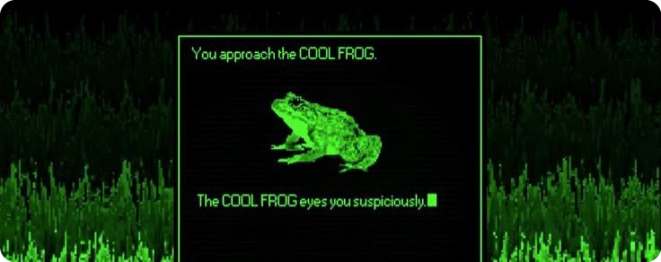

<!-- Баннер: замени на свою картинку. Проще всего залить png/jpg/gif прямо в репозиторий
     (например assets/banner.png) и указать путь ниже — GitHub отрисует его в README. -->

  

 

<h1 align="center">kiratonine</h1>

<i>software engineer · hackathon addict · musician</i>

### about
software engineer & enthusiast. Co-founder at S1lk x402 Bridge.
 **https://slkp.vercel.app/**.

📍 Almaty &nbsp;•&nbsp; ✉️ mrakirascream@gmail.com &nbsp;•&nbsp;

---

### core skills

  

- **languages:** javascript · typescript · sql
- **backend:** node.js · express · rest apis
- **databases:** sqlite · postgresql

---

### 🔗 Links

